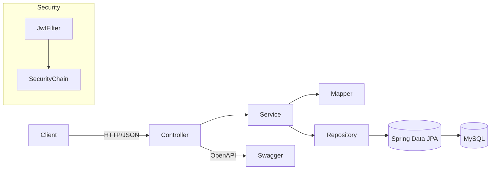

# BookHub API — Spring Boot REST API

A production-ready REST API for an online bookstore. Shoppers can browse/search books, manage a cart, and place orders. Admins manage the catalog and order lifecycle. The project was built step-by-step as a portfolio piece and follows clean layering, strong validation, CI, and containerized deployment.

> **Tech highlights:** Spring Boot 3, Spring Security (JWT), Spring Data JPA, Liquibase, MapStruct, Bean Validation, Swagger/OpenAPI, Docker & Docker Compose, GitHub Actions CI, H2 for tests.

---

## Table of Contents

- [Demo & Docs](#demo--docs)  
- [Features](#features)  
- [Architecture](#architecture)  
- [Tech Stack](#tech-stack)  
- [Domain Model](#domain-model)  
- [Database ER Diagram](#database-er-diagram)
- [Clone the Project](#clone-the-project)
- [API Endpoints (summary)](#api-endpoints-summary)  
- [Quick Start](#quick-start)  
  - [Run with Docker Compose (recommended)](#run-with-docker-compose-recommended)  
  - [Run locally (Maven, local MySQL)](#run-locally-maven-local-mysql)  
  - [Use prebuilt image from Docker Hub](#use-prebuilt-image-from-docker-hub)  
- [Environment Variables](#environment-variables)  
- [Swagger & Sample Requests](#swagger--sample-requests)  
- [Testing & Coverage](#testing--coverage)  
- [Database & Migrations](#database--migrations)  
- [Security & Roles](#security--roles)  
- [Development Workflow](#development-workflow)  
- [Troubleshooting](#troubleshooting)  
- [Challenges & Lessons Learned](#challenges--lessons-learned)  
- [Roadmap](#roadmap)  
- [License](#license)

---

## Demo & Docs

- **Base URL** (default): `http://localhost:8080/api`
- **Swagger UI**: `http://localhost:8080/api/swagger-ui/index.html`
- **OpenAPI JSON**: `http://localhost:8080/api/v3/api-docs`

> The app runs behind the context path `/api`.

---

## Features

### Public
- **User registration** with validation
- **JWT login** and token issuance

### User (ROLE_USER)
- Browse **book catalog** with pagination & sorting
- View **book details**
- Browse **categories** and category books
- Manage **shopping cart** (add/update/remove items)
- Place **orders** and view **order history**
- View **order items**

### Admin (ROLE_ADMIN)
- Full **book management** (create/update/soft delete)
- **Category** management (create/update/delete)
- **Order status** updates (PATCH)

### Cross-cutting
- **DTOs + MapStruct** for clean API models
- **Global exception handler** and meaningful validation messages
- **Liquibase** migrations; **soft delete** for books
- **Checkstyle** enforced by **GitHub Actions CI**
- **Docker** & **Docker Compose** for one-command spin-up
- **H2** in tests so CI never depends on MySQL

---

## Architecture



- **Controller**: REST endpoints, pagination/sorting, validation.
- **Service**: business logic, security rules, mapping.
- **Repository**: Spring Data JPA (JpaRepository).
- **Liquibase**: versioned schema & seed data (roles, admin user, etc.).
- **Security**: Spring Security + JWT (public auth endpoints; role-based access).

---

## Tech Stack

- **Java 17**, **Spring Boot 3.4**
- **Spring Web**, **Spring Security**, **JWT**
- **Spring Data JPA** (Hibernate 6)
- **Liquibase**
- **MapStruct** + **Lombok**
- **Bean Validation** (Jakarta)
- **Swagger/OpenAPI** (springdoc-openapi)
- **MySQL 8** (runtime), **H2** (tests)
- **Maven**, **Checkstyle**
- **Docker**, **Docker Compose**
- **GitHub Actions** CI

---

## Domain Model

- **User** *(id, email, password, firstName, lastName, shippingAddress, roles)*
- **Role** *(id, name: USER/ADMIN)*
- **Book** *(id, title, author, isbn, price, description, coverImage, deleted)* → **soft delete**
- **Category** *(id, name, description, books)*
- **ShoppingCart** *(id, user, items)*
- **CartItem** *(id, cart, book, quantity)*
- **Order** *(id, user, status, total, orderDate, shippingAddress, orderItems)*
- **OrderItem** *(id, order, book, quantity, price)*

---

## Database ER Diagram

The diagram below represents the **physical database model** of the application.
It is generated based on actual JPA entities and reflects real tables,
join tables, foreign keys, and soft delete flags.


---

## Clone the Project

Clone the repository and navigate to the project directory:

```bash
git clone https://github.com/buriy88/online-book-store.git
cd online-book-store
```

### Prerequisites

Make sure the following tools are installed:
- **Java 17+**
- **Maven 3.9+**
- **Docker & Docker Compose** (recommended)

After cloning the project, choose one of the run options below.

---

## API Endpoints (summary)

> **Auth (public):**
- `POST /api/auth/register` — register new user  
- `POST /api/auth/login` — login & get JWT

> **Books (USER):**
- `GET /api/books` — list (pagination & sorting)
- `GET /api/books/{id}` — details
- `GET /api/books/search?title=...&author=...&isbn=...` — search

> **Books (ADMIN):**
- `POST /api/books` — create  
- `PUT /api/books/{id}` — update  
- `DELETE /api/books/{id}` — soft delete

> **Categories (USER):**
- `GET /api/categories` — list
- `GET /api/categories/{id}` — details
- `GET /api/categories/{id}/books` — books in category

> **Categories (ADMIN):**
- `POST /api/categories` — create
- `PUT /api/categories/{id}` — update
- `DELETE /api/categories/{id}` — delete

> **Cart (USER):**
- `GET /api/cart`
- `POST /api/cart` — add item
- `PUT /api/cart/cart-items/{cartItemId}` — update qty
- `DELETE /api/cart/cart-items/{cartItemId}` — remove item

> **Orders (USER):**
- `POST /api/orders` — place order
- `GET /api/orders` — order history
- `GET /api/orders/{orderId}/items` — all items
- `GET /api/orders/{orderId}/items/{itemId}` — specific item

> **Orders (ADMIN):**
- `PATCH /api/orders/{id}` — update status

---

## Quick Start

### Run with Docker Compose (recommended)

1) Create a **`.env`** file in project root:
```dotenv
# --- MySQL ---
MYSQLDB_USER=youruser
MYSQLDB_PASSWORD=yourpassword
MYSQLDB_DATABASE=bookstore
MYSQLDB_ROOT_PASSWORD=yourrootpass
MYSQLDB_PORT=3307
MYSQLDB_BASE_PORT=3306

# --- App ---
APP_HOST_PORT=8080
JWT_SECRET=change_me_to_a_long_random_string
```

2) Run:
```bash
docker compose pull
docker compose up -d
docker compose logs -f app
```

3) Open **Swagger**: `http://localhost:8080/api/swagger-ui/index.html`

> The compose file also includes a healthcheck for MySQL and waits before starting the app.

### Run locally (Maven, local MySQL)

- Start MySQL and create a DB named `bookstore`.  
- Set env vars (or edit `application.properties`):
  - `MYSQL_HOST=localhost`
  - `MYSQL_PORT=3306`
  - `MYSQLDB_DATABASE=bookstore`
  - `MYSQLDB_USER=youruser`
  - `MYSQLDB_PASSWORD=yourpassword`
  - `JWT_SECRET=your_jwt_secret`
- Run:
```bash
mvn clean verify
mvn spring-boot:run
```
- Swagger: `http://localhost:8080/api/swagger-ui/index.html`

### Use prebuilt image from Docker Hub

Pull and run the app container (point it to an existing MySQL instance):
```bash
docker pull buriy88/online-book-store:latest

docker run --rm -p 8080:8080   -e MYSQL_HOST=<mysql-host-or-service>   -e MYSQL_PORT=3306   -e MYSQLDB_DATABASE=bookstore   -e MYSQLDB_USER=youruser   -e MYSQLDB_PASSWORD=yourpassword   -e JWT_SECRET=your_jwt_secret   buriy88/online-book-store:latest
```

> If you run **only** the app container, `MYSQL_HOST` must be a reachable host (e.g., `host.docker.internal` for your local DB). When using **docker-compose**, the host is simply the service name `mysql`.

---

## Environment Variables

The app reads DB settings from env (with safe defaults). Common ones:

| Key | Example | Notes |
|---|---|---|
| `MYSQL_HOST` | `mysql` / `localhost` | `mysql` is the compose service name |
| `MYSQL_PORT` | `3306` | |
| `MYSQLDB_DATABASE` | `bookstore` | |
| `MYSQLDB_USER` | `buriy` | |
| `MYSQLDB_PASSWORD` | `StrongPassword123` | |
| `JWT_SECRET` | long random string | used to sign JWTs |
| `jwt.expiration` | `86400000` | can be set in properties |

---

## Swagger & Sample Requests

**Register**
```bash
curl -X POST http://localhost:8080/api/auth/register   -H "Content-Type: application/json"   -d '{
    "email":"john.doe@example.com",
    "password":"securePassword123",
    "repeatPassword":"securePassword123",
    "firstName":"John",
    "lastName":"Doe",
    "shippingAddress":"123 Main St"
  }'
```

**Login**
```bash
curl -X POST http://localhost:8080/api/auth/login   -H "Content-Type: application/json"   -d '{"email":"john.doe@example.com","password":"securePassword123"}'
# => { "token": "..." }
```

**Authorized request**
```bash
TOKEN=eyJhbGciOi...
curl http://localhost:8080/api/books   -H "Authorization: Bearer $TOKEN"
```

---

## Testing & Coverage

- **Unit/Integration tests** cover repositories, services, and controllers for **Book** and **Category**.
- Tests run against **H2** using `src/test/resources/application.properties`:
  - H2 JDBC URL, driver, dialect set for CI.
- Run tests & Checkstyle:
```bash
mvn clean verify
```
- Coverage report (JaCoCo) available under `target/site/jacoco/`.  
  *(In PRs I aim for ≥50% lines coverage for Book/Category controllers & services.)*

---

## Database & Migrations

- Schema managed by **Liquibase** (`db/changelog/master-changelog.yaml`).
- Changesets include:
  - Core tables (books, users, roles, categories, carts, orders…)
  - Seed roles (**ROLE_USER**, **ROLE_ADMIN**)
  - Seed admin user & role assignment *(check changeset for the credentials used)*.
- **Production**: `spring.jpa.hibernate.ddl-auto=validate`  
- **Soft delete** for books (DELETE marks a flag; reads ignore deleted rows).

---

## Security & Roles

- **Spring Security + JWT**
- Public endpoints:
  - `POST /api/auth/register`, `POST /api/auth/login`
- **ROLE_USER** can:
  - Read books/categories, manage cart, place orders, view order history/items
- **ROLE_ADMIN** can:
  - Manage books & categories, update order status

> Method-level security via `@PreAuthorize` where appropriate.  
> Swagger docs left open via security config (`/swagger-ui/**`, `/v3/api-docs/**`).

---

## Development Workflow

- **Git Flow (simplified):**
  1. Create a branch from `master/main`
  2. Implement HW/task
  3. Commit with concise message (5–6 words)
  4. Push & open PR
  5. Merge after approval
- **Auto delete branches** after merge (GitHub settings → General).
- **CI**: GitHub Actions (`.github/workflows/ci.yml`)
  - JDK 17 with Maven cache
  - `mvn --batch-mode --update-snapshots verify`
- **Code style**: Checkstyle (`checkstyle.xml`) enforced in `compile` phase  
  - With MapStruct, add:
    ```xml
    <sourceDirectories>src/main</sourceDirectories>
    ```
    to the `maven-checkstyle-plugin` to skip generated sources.

---

## Troubleshooting

- **App fails with `UnknownHost mysql`** when using `docker run` only  
  ➜ Set `MYSQL_HOST` to a reachable host (e.g., `host.docker.internal`) or run via **docker-compose** so the service name `mysql` resolves.

- **Liquibase “Communications link failure” on startup**  
  ➜ DB wasn’t ready. Compose uses healthcheck + `depends_on` to wait. If running manually, start MySQL first.

- **Checkstyle errors in MapStruct generated classes**  
  ➜ Limit Checkstyle to source dirs as shown above.

- **CI fails after switching to MySQL**  
  ➜ Ensure test `application.properties` uses **H2** (url/driver/dialect) and add H2 dependency with `test` scope.

---

## Challenges & Lessons Learned

- **DB startup race**: solved with Compose `depends_on` + **healthcheck**.  
- **Running app image standalone**: JDBC URL uses host `mysql` inside Compose; when running alone, you must pass `MYSQL_HOST`.  
- **Liquibase vs Hibernate DDL**: switched to `validate` and migrated schema changes into Liquibase changesets.  
- **MapStruct + Checkstyle**: excluded generated sources via `sourceDirectories` to keep CI green.  
- **JWT Security**: ordered `JwtAuthenticationFilter` in the `SecurityFilterChain` and exposed Swagger endpoints.

---

## Roadmap

- Email verification & password reset  
- Book images upload (S3/minio)  
- Caching of catalog endpoints  
- More tests & higher coverage  
- Dockerized Nginx as reverse proxy  
- Postman collection export under `docs/postman/` and CI artifact

---

## License

MIT — feel free to use parts of this project for learning and interviews.

---

### Credits

This app was built as a multi-step course project. It’s designed to be both a learning journey and a portfolio-ready service with real-world patterns.

---

### Docker Hub

Prebuilt image: **`buriy88/online-book-store:latest`**
